# SEIS-763: Midterm Project — Stock Market Movement Prediction

**Team Members:** Brahmee Adhikari, Don C. Nguyen

---

## Goal

This project builds machine learning models to predict stock price movement using historical daily price data. Two tasks are performed:

1. **Classification** — Predict whether a stock's price will go **UP or DOWN** the next trading day.
2. **Regression** — Predict **how much the price will change** over the next 5 trading days.

Both tasks are applied to two tickers:
- **SPY** — An S&P 500 ETF representing a stable, broad-market benchmark
- **TSLA** — Tesla, Inc., a high-volatility individual stock

Comparing the two tickers reveals whether stability or volatility makes a stock easier to predict, and how extreme market events affect model performance.

---

## Data Source

Historical daily stock price data is sourced from the **Polygon.io API** (formerly Massive):
- https://polygon.io

Data spans approximately **2 years** of trading days for both SPY and TSLA. Each trading day includes the following native attributes returned by the API:

| Attribute | Description |
|---|---|
| `open` | Price at market open |
| `high` | Highest price of the day |
| `low` | Lowest price of the day |
| `close` | Price at market close |
| `volume` | Number of shares traded |
| `vwap` | Volume Weighted Average Price |

From these attributes, additional features are derived (see Key Terms below).

---

## Key Terms

### Stock Market Terms

| Term | Definition |
|---|---|
| **Daily Return** | The percentage change in a stock's closing price from one day to the next. Captures short-term momentum. |
| **Weekly Return** | The percentage change in closing price over the past 5 trading days (~1 week). |
| **Moving Average (20-day)** | The average closing price over the past 20 trading days. Smooths out noise and reveals the medium-term trend. |
| **Distance from 20-day MA** | How far today's price is above or below the 20-day moving average, expressed as a percentage. Indicates whether a stock is overbought or oversold relative to its recent trend. |
| **Daily Range** | The difference between a day's high and low price, normalized by the closing price. Measures intraday volatility. |
| **Volume** | The total number of shares traded in a day. High volume often signals strong conviction behind a price move. |
| **Volume Change** | The day-over-day percentage change in trading volume. |
| **VWAP (Volume Weighted Average Price)** | The average price a stock traded at throughout the day, weighted by volume. A common institutional benchmark. |
| **VWAP Distance** | How far the closing price is from VWAP. Indicates whether the stock closed above or below the average trade price. |
| **Volatility (20-day)** | The rolling standard deviation of daily returns over 20 days. Higher values mean more unpredictable price swings. |
| **RSI (Relative Strength Index)** | A momentum indicator scaled 0–100. Values above 70 suggest a stock is overbought; below 30 suggests oversold. Calculated over 14 days. |
| **Bollinger Band Position** | Where today's closing price sits within the Bollinger Bands, which are set 2 standard deviations above and below the 20-day moving average. Values near +1 or -1 suggest price is at the edge of its recent range. |
| **VIX (CBOE Volatility Index)** | A real-time index published by the Chicago Board Options Exchange (CBOE) that measures the market's expectation of volatility over the next 30 days. It is derived from the implied volatility of S&P 500 options — when traders are willing to pay more for options (i.e., hedging against large swings), VIX rises. Often called the "fear gauge," VIX tends to spike sharply during crises and remain elevated until conditions stabilize. A VIX above 30 is a widely used threshold for heightened market stress. In this project, VIX daily closing prices are fetched from Polygon.io (`I:VIX`) and used to derive the extreme event indicator. |
| **Extreme Event Indicator** | A boolean (True/False) flag marking trading days where the VIX closing price exceeded 30, indicating a period of elevated market fear or stress. Rather than hardcoding specific crash dates, this approach is data-driven: it automatically captures any shock period in the dataset where volatility was abnormally high. Helps the model distinguish genuine market disruptions from normal day-to-day noise. |
| **SPY** | The SPDR S&P 500 ETF Trust. Tracks the S&P 500 index, representing 500 large U.S. companies. Used here as a stable market benchmark. |
| **TSLA** | Tesla, Inc. A high-growth, high-volatility individual stock used here as a contrast to SPY. |

### Machine Learning Terms

| Term | Definition |
|---|---|
| **Feature (Independent Variable)** | An input variable used by the model to make a prediction. In this project, features include daily return, RSI, volume change, etc. |
| **Target (Dependent Variable)** | The value the model is trying to predict. Here: next-day direction (classification) or 5-day price change (regression). |
| **Classification** | A type of ML task where the model predicts a discrete category. Here: UP or DOWN. |
| **Regression** | A type of ML task where the model predicts a continuous numeric value. Here: 5-day forward return. |
| **Logistic Regression** | A classification algorithm that estimates the probability of a binary outcome (UP or DOWN) using a logistic curve. Simple and interpretable. |
| **Linear Regression** | A regression algorithm that fits a straight line through training data to predict continuous values. |
| **Ridge Regression** | A variant of linear regression that adds a penalty for large coefficients, reducing overfitting when features are correlated. |
| **Random Forest** | An ensemble of many decision trees that each vote on the prediction. More powerful than a single tree and provides built-in feature importance scores. |
| **XGBoost** | A gradient boosting algorithm that builds trees sequentially, each correcting the errors of the previous. Often the top performer on structured/tabular data. |
| **Training** | The process of fitting a model to historical data so it learns patterns. |
| **Testing** | Evaluating the model on data it has never seen to measure real-world performance. |
| **Overfitting** | When a model learns the training data too precisely, including its noise, and fails to generalize to new data. |
| **Walk-Forward Validation** | A time-aware testing strategy where the model is trained on a past window of data and tested on the immediately following window, repeating across multiple periods. Prevents data leakage and simulates real trading conditions. |
| **Data Leakage** | When information from the future accidentally influences the training process, producing misleadingly optimistic results. |
| **Feature Importance / Weights** | A score assigned to each feature indicating how much it influenced the model's predictions. Computed via `model.coef_` for linear models and `model.feature_importances_` for tree-based models. |
| **Standardization (StandardScaler)** | Rescaling features to have a mean of 0 and standard deviation of 1, so no single feature dominates due to scale differences. |
| **MAE (Mean Absolute Error)** | Average absolute difference between predicted and actual values. Intuitive and robust to outliers. |
| **RMSE (Root Mean Squared Error)** | Square root of the average squared error. Penalizes large mistakes more than MAE — important in finance where big misses are costly. |
| **R² (R-squared)** | Proportion of variance in the target explained by the model. A value of 1.0 is perfect; negative values mean the model performs worse than simply predicting the mean. |
| **Precision** | Of all days the model predicted as UP, the fraction that actually went UP. Low precision means the model generates many false buy signals — a trader acting on every UP prediction would frequently lose money on days that actually went down. |
| **Recall** | Of all days that actually went UP, the fraction the model correctly identified. Low recall means the model misses many genuine opportunities — a conservative model that rarely predicts UP will have high precision but low recall. |
| **F1 Score** | Harmonic mean of precision and recall. A single number that balances both risks: false buy signals (low precision) and missed opportunities (low recall). More informative than accuracy alone when classes are nearly balanced. |
| **Confusion Matrix** | A table showing correct and incorrect predictions broken down by class (e.g., Predicted Up vs. Actual Up). |
| **Seasonal Analysis** | Grouping model results by time of year (spring, summer, fall, winter) to identify whether market conditions in certain seasons are more predictable. |
| **Realized Volatility** | The actual, observed volatility of a stock over a past window — computed as the standard deviation of daily returns over N days. Used as the regression target in the second iteration (`target_volatility`), replacing the 5-day forward return. Volatility is more learnable than raw return direction because it is directly driven by the technical features already in the model (VIX, daily range, RSI). |
| **Softened Target** | A classification target that filters out small, ambiguous price moves rather than forcing a binary UP/DOWN label on every day. In the second iteration, days with returns within ±0.5% (SPY) or ±1.5% (TSLA) of zero are labeled FLAT (0) instead of UP or DOWN. This gives the model cleaner signal on days where a genuine trend is present and reduces noise from microstructure. |
| **FLAT Class** | The third label in the softened 3-class classification target (Down = -1, Flat = 0, Up = 1). Represents a trading day where the stock's move was too small to be a meaningful directional signal. Adding FLAT lowers the random-classifier F1 baseline from ~0.50 to ~0.33, so scores above ~0.38 represent meaningful learning. |
| **L2 Regularization** | A penalty added to a model's loss function that discourages large coefficient values. Proportional to the sum of squared coefficients. Ridge Regression applies L2 regularization to reduce overfitting when input features are correlated with each other — which is common with technical indicators (e.g., RSI, Bollinger Band position, and distance from MA all measure similar things). |
| **Embargo (Walk-Forward)** | A mandatory gap of N trading days inserted between the end of a training window and the start of the test window in walk-forward validation. Prevents feature leakage when features are computed over a rolling window — without an embargo, the last rows of the training window and the first rows of the test window share overlapping feature calculations. In this project a **5-day embargo** is applied at each fold boundary. |

---

## How Testing Is Done

Testing uses **walk-forward validation** — a time-series aware evaluation strategy that prevents data leakage and simulates realistic trading conditions.

### Window Sizes (First Iteration)
- **Training window:** 63 trading days (~3 months)
- **Test window:** 42 trading days (~2 months)
- The 2-year dataset yields approximately **8–9 folds**

### Window Sizes (Second Iteration)
- **Training window:** 63 trading days (~3 months)
- **Test window:** 21 trading days (~1 month)
- **Embargo:** 5 trading days between train end and test start
- The 10-year dataset yields approximately **58 folds**

### Process
Each fold trains the model exclusively on its training window, then predicts the immediately following test window. A 5-day embargo separates the two to prevent feature leakage from rolling window calculations. The next fold begins immediately after the previous test window ends:

```
Fold 1: Train [day 1   → day 63],  Embargo [day 64–68],  Test [day 69  → day 89]
Fold 2: Train [day 69  → day 131], Embargo [day 132–136], Test [day 137 → day 157]
Fold 3: Train [day 137 → day 199], Embargo [day 200–204], Test [day 205 → day 225]
...
```

This approach captures performance across multiple market conditions rather than a single arbitrary split.

### Metrics Reported
Results are aggregated as **mean ± standard deviation** across all folds.

| Task | Primary Metric | Supporting Metrics |
|---|---|---|
| Regression | RMSE | MAE, R² |
| Classification | F1 Score | Accuracy, Confusion Matrix |

Standard deviation across folds measures **consistency** — a model with lower std is more reliable across different market conditions.

---

## Models

All models are evaluated using walk-forward validation across both tickers independently.

### Regression Models
Predict the **5-day forward return** — the percentage price change from today's close to the close 5 trading days from now. A positive value means the model expects the price to rise; negative means it expects a decline.

| Model | Purpose | Primary Metric | Supporting Metrics |
|---|---|---|---|
| **Linear Regression** | Baseline model. Fits a straight line through the feature space to predict the 5-day return as a weighted sum of inputs. Coefficients reveal which features most influence the prediction. | RMSE | MAE, R² |
| **Ridge Regression** | Extension of linear regression with L2 regularization — penalizes large coefficients to reduce overfitting. Particularly useful here because technical indicators (RSI, Bollinger Band position, distance from MA) are often correlated with each other. | RMSE | MAE, R² |
| **XGBoost** | Gradient boosting ensemble that builds decision trees sequentially, each correcting the residual errors of the prior tree. Captures non-linear relationships between features and returns that linear models cannot, and provides feature importance scores. | RMSE | MAE, R² |

### Classification Models
Predict the **next-day price direction** — whether the stock will close higher (UP = 1) or lower (DOWN = 0) than today.

| Model | Purpose | Primary Metric | Supporting Metrics |
|---|---|---|---|
| **Logistic Regression** | Baseline classifier. Models the probability of an UP move using a logistic curve. Simple and interpretable — log-odds coefficients show which features linearly push the prediction toward UP or DOWN. | F1 | Precision, Recall, Accuracy, Confusion Matrix |
| **Random Forest** | Ensemble of decision trees that each vote independently on direction. More robust than a single tree; handles non-linear feature interactions and is less sensitive to noisy features. Provides feature importance scores based on how often each feature is used to split. | F1 | Precision, Recall, Accuracy, Confusion Matrix |

---

## Results

Results are reported as **mean ± standard deviation** across all walk-forward folds. Standard deviation measures consistency — a lower value means the model performs reliably across different market conditions, not just in one favorable period.

### SPY — Regression (5-day forward return)

| Model | RMSE (mean ± std) | MAE (mean ± std) | R² (mean ± std) |
|---|---|---|---|
| Linear Regression | 0.032680 ± 0.023691 | 0.026165 ± 0.020355 | -2.4955 ± 3.8170 |
| Ridge Regression | 0.029199 ± 0.020192 | 0.023036 ± 0.017339 | -1.6488 ± 2.6224 |
| XGBoost | 0.025754 ± 0.012481 | 0.019259 ± 0.009262 | -1.0600 ± 1.0182 |

### SPY — Classification (next-day direction)

| Model | F1 (mean ± std) | Precision (mean ± std) | Recall (mean ± std) | Accuracy (mean ± std) |
|---|---|---|---|---|
| Logistic Regression | 0.4605 ± 0.0804 | 0.5752 ± 0.1335 | 0.5243 ± 0.0469 | 0.5423 ± 0.0881 |
| Random Forest | 0.5094 ± 0.0733 | 0.5613 ± 0.0647 | 0.5505 ± 0.0498 | 0.5344 ± 0.0705 |

### TSLA — Regression (5-day forward return)

| Model | RMSE (mean ± std) | MAE (mean ± std) | R² (mean ± std) |
|---|---|---|---|
| Linear Regression | 0.117630 ± 0.048685 | 0.097380 ± 0.042914 | -1.5955 ± 1.5091 |
| Ridge Regression | 0.112860 ± 0.047628 | 0.093590 ± 0.041686 | -1.3942 ± 1.4484 |
| XGBoost | 0.106195 ± 0.031106 | 0.084940 ± 0.025590 | -1.2977 ± 1.3457 |

### TSLA — Classification (next-day direction)

| Model | F1 (mean ± std) | Precision (mean ± std) | Recall (mean ± std) | Accuracy (mean ± std) |
|---|---|---|---|---|
| Logistic Regression | 0.4439 ± 0.0970 | 0.4514 ± 0.1323 | 0.5123 ± 0.0390 | 0.5079 ± 0.0630 |
| Random Forest | 0.4929 ± 0.0473 | 0.5222 ± 0.0425 | 0.5185 ± 0.0404 | 0.5053 ± 0.0426 |

### Seasonal Breakdown

Performance broken down by season (Spring: Mar–May, Summer: Jun–Aug, Fall: Sep–Nov, Winter: Dec–Feb) to identify which market periods are most predictable.

#### SPY — Regression

| Model | Season | RMSE | MAE | R² | n |
|---|---|---|---|---|---|
| Linear Regression | Spring | 0.082822 | 0.072579 | -3.7047 | 63 |
| Linear Regression | Summer | 0.025874 | 0.021037 | -1.9116 | 80 |
| Linear Regression | Fall | 0.021934 | 0.015780 | -0.8844 | 126 |
| Linear Regression | Winter | 0.020531 | 0.015106 | -0.7362 | 109 |
| Ridge Regression | Spring | 0.072096 | 0.062195 | -2.5650 | 63 |
| Ridge Regression | Summer | 0.021907 | 0.017346 | -1.0873 | 80 |
| Ridge Regression | Fall | 0.019774 | 0.014445 | -0.5315 | 126 |
| Ridge Regression | Winter | 0.020126 | 0.014509 | -0.6684 | 109 |
| XGBoost | Spring | 0.050827 | 0.039220 | -0.7719 | 63 |
| XGBoost | Summer | 0.024837 | 0.018364 | -1.6830 | 80 |
| XGBoost | Fall | 0.020643 | 0.014256 | -0.6691 | 126 |
| XGBoost | Winter | 0.018489 | 0.014161 | -0.4080 | 109 |

#### SPY — Classification

| Model | Season | F1 | Precision | Recall | Accuracy | n |
|---|---|---|---|---|---|---|
| Logistic Regression | Spring | 0.3930 | 0.3957 | 0.3935 | 0.3968 | 63 |
| Logistic Regression | Summer | 0.4264 | 0.4436 | 0.4648 | 0.5125 | 80 |
| Logistic Regression | Fall | 0.5478 | 0.5713 | 0.5540 | 0.6190 | 126 |
| Logistic Regression | Winter | 0.4871 | 0.6046 | 0.5497 | 0.5596 | 109 |
| Random Forest | Spring | 0.4439 | 0.4574 | 0.4583 | 0.4444 | 63 |
| Random Forest | Summer | 0.4617 | 0.4783 | 0.4789 | 0.4625 | 80 |
| Random Forest | Fall | 0.5553 | 0.5562 | 0.5591 | 0.5714 | 126 |
| Random Forest | Winter | 0.5775 | 0.6077 | 0.5910 | 0.5963 | 109 |

#### TSLA — Regression

| Model | Season | RMSE | MAE | R² | n |
|---|---|---|---|---|---|
| Linear Regression | Spring | 0.181320 | 0.153579 | -1.4741 | 63 |
| Linear Regression | Summer | 0.085474 | 0.065566 | -1.2383 | 80 |
| Linear Regression | Fall | 0.125973 | 0.090276 | -0.9983 | 126 |
| Linear Regression | Winter | 0.112173 | 0.096461 | -1.2922 | 109 |
| Ridge Regression | Spring | 0.170715 | 0.143752 | -1.1932 | 63 |
| Ridge Regression | Summer | 0.079302 | 0.061654 | -0.9267 | 80 |
| Ridge Regression | Fall | 0.123982 | 0.088431 | -0.9356 | 126 |
| Ridge Regression | Winter | 0.109250 | 0.094000 | -1.1743 | 109 |
| XGBoost | Spring | 0.127032 | 0.103329 | -0.2144 | 63 |
| XGBoost | Summer | 0.100555 | 0.079171 | -2.0978 | 80 |
| XGBoost | Fall | 0.115734 | 0.081984 | -0.6866 | 126 |
| XGBoost | Winter | 0.099294 | 0.081961 | -0.7961 | 109 |

#### TSLA — Classification

| Model | Season | F1 | Precision | Recall | Accuracy | n |
|---|---|---|---|---|---|---|
| Logistic Regression | Spring | 0.4061 | 0.4388 | 0.4576 | 0.4444 | 63 |
| Logistic Regression | Summer | 0.4591 | 0.5000 | 0.5000 | 0.5000 | 80 |
| Logistic Regression | Fall | 0.4973 | 0.5078 | 0.5067 | 0.5317 | 126 |
| Logistic Regression | Winter | 0.5080 | 0.5651 | 0.5516 | 0.5229 | 109 |
| Random Forest | Spring | 0.4714 | 0.4808 | 0.4818 | 0.4762 | 63 |
| Random Forest | Summer | 0.4972 | 0.5000 | 0.5000 | 0.5000 | 80 |
| Random Forest | Fall | 0.5453 | 0.5466 | 0.5474 | 0.5476 | 126 |
| Random Forest | Winter | 0.4771 | 0.4839 | 0.4839 | 0.4771 | 109 |

---

## Validating and Interpreting Results — First Iteration

The first iteration used the **Polygon/Massive API** dataset (~476 rows, 2024–2026, 10 features) evaluated with 9 walk-forward folds. Results are sourced from `midterm.ipynb`.

### EDA Visuals

**VIX Volatility Index (2015–2025)**

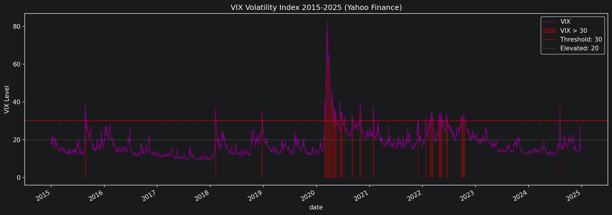

Three distinct stress periods are visible: the 2018 Volmageddon spike (~37), the Q4 2018 Fed rate-hike sell-off, and the COVID crash in March 2020 (peak ~82.69). The red shaded regions mark days where VIX exceeded 30 — the threshold used for `is_major_event`. In the 10-year window, 144+ trading days exceeded this threshold. In the 2-year Polygon window used for first-iteration modeling, only 15 days crossed it.

---

**Close Price Over Time**

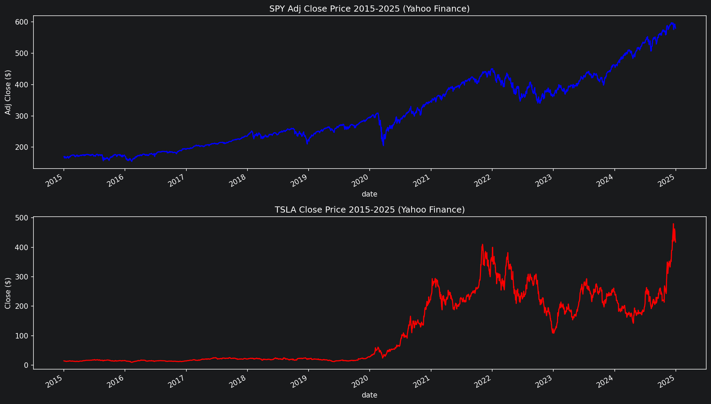

SPY (blue) shows steady growth from ~$170 (adjusted) in 2015 to ~$570+ by 2025, with only the COVID crash producing a visible dip. TSLA (red) was flat through 2019, then surged dramatically in 2020–2022 before crashing into 2023 and recovering post-election in late 2024. TSLA's price range (~$14 → $400+) is roughly 30× wider than SPY's, directly reflected in its higher RMSE in regression.

---

**Volume Over Time**

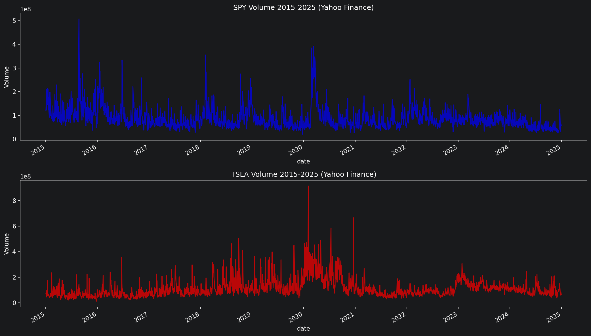

Both tickers show volume spikes aligned with VIX > 30 periods. SPY's COVID crash spike reached ~500M shares/day (6× average). TSLA's 2020–2021 meme-stock era spike reached ~900M shares/day (8× average). High-volume days are captured by `is_major_event` and `volume_ratio`.

---

**SPY vs TSLA Correlation**

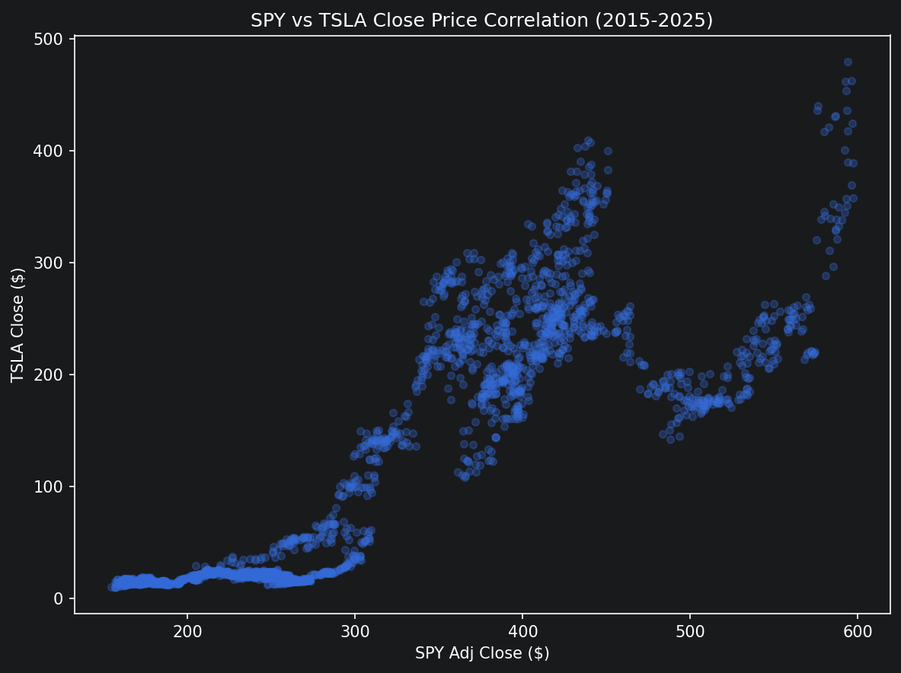

Correlation ~0.87, driven primarily by shared long-term upward trend rather than daily co-movement. The scatter plot shows distinct market era clusters: TSLA flat and low through 2019, explosive divergence in 2020–2022, and erratic high-price behavior in recent years. This validates the decision to model each ticker independently.

---

**VIX vs Daily Returns**

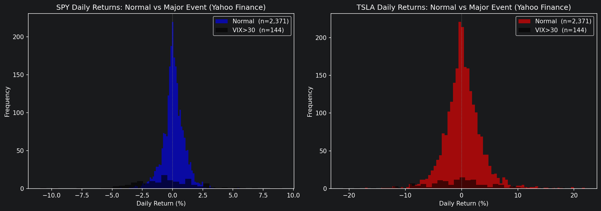

During normal periods (VIX < 30), SPY has a mean daily return of ~+0.06% with std ~0.8%. During VIX > 30 periods, the mean flips to ~-0.05% with std ~2.1% — more than double the volatility. TSLA shows the same pattern at ~2.3× the magnitude. This confirms that market stress regime is a meaningful signal, but the 2-year Polygon dataset had too few stress days (15) for the model to learn from it.

---

**VIX Level vs Mean Daily Return (Binned)**

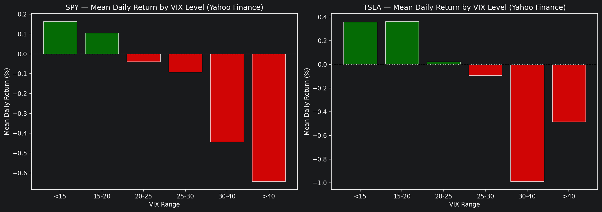

A clear monotonic relationship: as VIX rises, average daily returns fall. Calm markets (VIX < 15) produce the highest average returns; VIX > 30 produces negative average returns. This signal is real and consistent across both data sources, but it only helps the model during the relatively rare stress periods.

---

**Average Daily Return by Month**

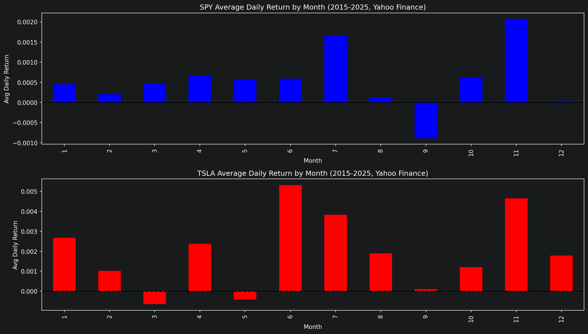

September is the weakest month for both tickers (the well-documented "September Effect"). November is among the strongest. This monthly pattern is consistent across Yahoo Finance and Polygon datasets and is directly reflected in the seasonal breakdown results below.

---

### Score Summary

All regression R² values are negative, meaning no model beats a naive "predict the mean" baseline for 5-day forward returns. This is consistent across all models and both tickers.

#### SPY — Regression

| Model | RMSE (mean ± std) | R² (mean ± std) |
|---|---|---|
| Linear Regression | 0.0327 ± 0.0237 | -2.496 ± 3.817 |
| Ridge Regression | 0.0292 ± 0.0202 | -1.649 ± 2.622 |
| **XGBoost** | **0.0258 ± 0.0125** | **-1.060 ± 1.018** |

#### SPY — Classification

| Model | F1 (mean ± std) | Accuracy (mean ± std) |
|---|---|---|
| Logistic Regression | 0.4605 ± 0.0804 | 0.5423 ± 0.0881 |
| **Random Forest** | **0.5094 ± 0.0733** | **0.5344 ± 0.0705** |

#### TSLA — Regression

| Model | RMSE (mean ± std) | R² (mean ± std) |
|---|---|---|
| Linear Regression | 0.1176 ± 0.0487 | -1.596 ± 1.509 |
| Ridge Regression | 0.1129 ± 0.0476 | -1.394 ± 1.448 |
| **XGBoost** | **0.1062 ± 0.0311** | **-1.298 ± 1.346** |

#### TSLA — Classification

| Model | F1 (mean ± std) | Accuracy (mean ± std) |
|---|---|---|
| Logistic Regression | 0.4439 ± 0.0970 | 0.5079 ± 0.0630 |
| **Random Forest** | **0.4929 ± 0.0473** | **0.5053 ± 0.0426** |

**XGBoost** was the best regression model for both tickers. **Random Forest** was the best classification model for both tickers.

---

### Seasonal Highlights

Fall (Sep–Nov) had the largest sample size (n=126) and was the most predictable season for regression across all models and both tickers. Spring (Mar–May) was consistently the hardest to predict — highest RMSE and lowest F1 in all configurations. Winter was the second-most predictable season for SPY classification (Random Forest F1: 0.5775).

---

### Challenges and Observations

**1. Noise in the regression target**

`target_return` (5-day forward return) is close to a random walk. Technical indicators explain an estimated 2–5% of the variance in 5-day returns. The remaining 95%+ is driven by news events, earnings surprises, Fed announcements, and large institutional order flow that technical features have no visibility into. All R² values being negative is not a modeling failure — it is a data sufficiency problem. Adding sentiment data, options market data, or macroeconomic factors would be required to meaningfully improve regression scores.

**2. Noise in the classification target**

`target_direction` (binary UP/DOWN) forces the model to classify every price move — including sub-0.5% moves that are indistinguishable from microstructure noise. The model is penalized equally for missing a 0.01% move and a 3% move. A softened target that filters out small moves would give the model cleaner signal on days where a genuine trend is present.

**3. `is_major_event` had zero coefficient weight**

The Polygon 2-year window (2024–2026) contained only 15 trading days with VIX > 30. This was insufficient for any model to learn the stress-regime signal. The 10-year Yahoo Finance dataset (2015–2025) contains 144+ such days, making this feature meaningful in the second iteration.

**4. Feature redundancy**

The second feature set (19 features) included correlated features: `macd`, `macd_signal`, and `macd_hist` are mathematically derived from each other (`macd_hist = macd - macd_signal`). Similarly, `volatility_7` and `volatility_20` overlap. These redundant features hurt Random Forest's vote-splitting and added noise to linear models without adding signal. The second iteration reduces to 16 features by removing the redundant ones.

**5. High variance across folds**

Standard deviation exceeded the mean for Linear Regression on SPY (std 0.0557 vs mean 0.0482), indicating the model performs well in some market regimes and fails badly in others. XGBoost was the most consistent (std ~40–50% of mean). Increasing the training window from 63 to 252 days would reduce this variance by exposing each fold to a more representative market history.

---

## Second Iteration

The second iteration addresses the challenges identified above. Full details and rationale are documented in `secrets/PlanV2.md`.

### Changes from First Iteration

| Area | First Iteration | Second Iteration |
|---|---|---|
| Data source | Polygon API (~476 rows, 2 years) | Yahoo Finance (~2,490 rows, 10 years) |
| Features | 10 features (includes `vwap_dist`) | 16 features (removes 3 redundant; no `vwap_dist`) |
| Classification target | Binary UP/DOWN on every move | 3-class: UP / FLAT / DOWN (±0.5% SPY, ±1.5% TSLA) |
| Regression target | 5-day forward return (near-random-walk) | 5-day forward realized volatility (features better aligned) |
| Walk-forward window | 63 train / 42 test / no embargo | 63 train / 21 test / 5-day embargo |
| Walk-forward folds | ~9 folds | ~58 folds |
| Code structure | Single monolithic notebook | Split into `data-fetch.ipynb`, `feature_engineering.ipynb`, `spy_modeling.ipynb`, `tsla_modeling.ipynb` |

### Validating and Interpreting Results — Second Iteration

Results are from `spy_modeling.ipynb` and `tsla_modeling.ipynb`, evaluated with **58 walk-forward folds** over the 10-year Yahoo Finance dataset (2015–2024, ~2,510 rows per ticker after NaN drop).

#### Target distributions (after softening)

| Ticker | Down (-1) | Flat (0) | Up (1) | Threshold |
|---|---|---|---|---|
| SPY | 549 (21.9%) | 1,261 (50.2%) | 700 (27.9%) | ±0.5% |
| TSLA | — | — | — | ±1.5% |

> **Note on F1 baseline:** With 3 classes, a random classifier scores ~0.33 F1 (vs. ~0.50 with binary). Any score above ~0.38 represents meaningful learning.

---

#### SPY — Regression (5-day forward realized volatility)

| Model | RMSE (mean ± std) | MAE (mean ± std) | R² (mean ± std) |
|---|---|---|---|
| Linear Regression | 0.007581 ± 0.005754 | 0.006211 ± 0.004878 | -4.7149 ± 9.5302 |
| Ridge Regression | 0.006933 ± 0.006420 | 0.005650 ± 0.005436 | -3.5593 ± 8.0326 |
| **XGBoost** | **0.005664 ± 0.005197** | **0.004564 ± 0.004267** | **-1.8470 ± 3.1703** |

#### SPY — Classification (next-day direction: Down / Flat / Up)

| Model | F1 (mean ± std) | Precision (mean ± std) | Recall (mean ± std) | Accuracy (mean ± std) |
|---|---|---|---|---|
| **Logistic Regression** | **0.3288 ± 0.0742** | **0.3542 ± 0.1313** | **0.3772 ± 0.0710** | **0.5107 ± 0.1509** |
| Random Forest | 0.3410 ± 0.0643 | 0.3740 ± 0.1085 | 0.3807 ± 0.0653 | 0.4963 ± 0.1385 |

#### SPY — Seasonal Breakdown (Regression — XGBoost)

| Season | RMSE | MAE | R² | n |
|---|---|---|---|---|
| Spring | 0.011374 | 0.005740 | -0.1112 | 614 |
| Summer | 0.006143 | 0.004114 | -0.2865 | 645 |
| **Fall** | **0.004975** | **0.003751** | **+0.1192** | 630 |
| Winter | 0.006548 | 0.004710 | -0.3181 | 547 |

#### SPY — Seasonal Breakdown (Classification — Random Forest)

| Season | F1 | Precision | Recall | Accuracy | n |
|---|---|---|---|---|---|
| Spring | 0.4136 | 0.4129 | 0.4151 | 0.4609 | 614 |
| Summer | 0.4127 | 0.4204 | 0.4208 | 0.5349 | 645 |
| **Fall** | **0.4350** | **0.4375** | **0.4357** | **0.5222** | 630 |
| Winter | 0.3992 | 0.4012 | 0.4020 | 0.4607 | 547 |

---

#### TSLA — Regression (5-day forward realized volatility)

| Model | RMSE (mean ± std) | MAE (mean ± std) | R² (mean ± std) |
|---|---|---|---|
| Linear Regression | 0.030008 ± 0.022531 | 0.024770 ± 0.019399 | -6.2707 ± 10.9782 |
| Ridge Regression | 0.024565 ± 0.013984 | 0.020150 ± 0.011250 | -3.1198 ± 4.2351 |
| **XGBoost** | **0.019440 ± 0.011024** | **0.015565 ± 0.009102** | **-1.3240 ± 1.5718** |

#### TSLA — Classification (next-day direction: Down / Flat / Up)

| Model | F1 (mean ± std) | Precision (mean ± std) | Recall (mean ± std) | Accuracy (mean ± std) |
|---|---|---|---|---|
| Logistic Regression | 0.2951 ± 0.0692 | 0.3337 ± 0.1114 | 0.3521 ± 0.0564 | 0.3941 ± 0.1047 |
| Random Forest | 0.2946 ± 0.0824 | 0.3300 ± 0.1191 | 0.3326 ± 0.0752 | 0.3810 ± 0.1122 |

#### TSLA — Seasonal Breakdown (Regression — XGBoost)

| Season | RMSE | MAE | R² | n |
|---|---|---|---|---|
| Spring | 0.024517 | 0.016258 | -0.6010 | 614 |
| Summer | 0.017845 | 0.014056 | -0.3097 | 645 |
| Fall | 0.023631 | 0.016905 | -0.4527 | 630 |
| Winter | 0.022837 | 0.015022 | -0.3828 | 547 |

#### TSLA — Seasonal Breakdown (Classification — Random Forest)

| Season | F1 | Precision | Recall | Accuracy | n |
|---|---|---|---|---|---|
| Spring | 0.3432 | 0.3456 | 0.3461 | 0.3648 | 614 |
| Summer | 0.3554 | 0.3570 | 0.3566 | 0.3953 | 645 |
| Fall | 0.3488 | 0.3492 | 0.3573 | 0.3968 | 630 |
| Winter | 0.3247 | 0.3251 | 0.3294 | 0.3638 | 547 |

---

### Comparing First and Second Iteration

#### Classification

The 3-class target (±0.5% SPY, ±1.5% TSLA) filters out small, noisy moves and forces the model to only predict when a clear directional signal is present. F1 scores are not directly comparable to the first iteration because the random baseline dropped from ~0.50 to ~0.33.

| Ticker | Model | 1st Iter F1 (binary) | 2nd Iter F1 (3-class) | Baseline |
|---|---|---|---|---|
| SPY | Logistic Regression | 0.4605 | 0.3288 | ~0.33 |
| SPY | Random Forest | 0.5094 | 0.3410 | ~0.33 |
| TSLA | Logistic Regression | 0.4439 | 0.2951 | ~0.33 |
| TSLA | Random Forest | 0.4929 | 0.2946 | ~0.33 |

SPY Random Forest's 0.3410 F1 sits just above the 0.33 random baseline, with the strongest performance in Fall (F1 0.4350). TSLA models struggle to clear the baseline — the added FLAT class is harder to identify for a high-volatility stock.

#### Regression

Targets changed (`target_return` → `target_volatility`), so RMSE values are not directly comparable. The key improvement metric is R²:

| Ticker | Model | 1st Iter R² | 2nd Iter R² |
|---|---|---|---|
| SPY | XGBoost | -1.0600 ± 1.0182 | -1.8470 ± 3.1703 |
| TSLA | XGBoost | -1.2977 ± 1.3457 | -1.3240 ± 1.5718 |

R² remains negative overall, but **SPY XGBoost achieves R² = +0.1192 in Fall** — the only positive R² in either iteration, meaning the model outperforms the naive mean baseline in that season. This is a meaningful improvement: Fall is the most stable and data-rich season (n=630), and the volatility target is better aligned with the technical features than the raw return target was.

#### Key findings

1. **XGBoost is consistently the best regression model** across both tickers and both iterations. Its RMSE standard deviation is roughly 50–60% of its mean (vs. 100%+ for linear models), making it the most consistent across market regimes.
2. **Fall is the most predictable season** for regression in both iterations. SPY XGBoost achieves the only positive R² (0.1192) in Fall — the 10-year dataset gives the model enough examples of fall volatility patterns to generalize.
3. **Volatility is more learnable than return direction** — the volatility target's negative R² values are smaller in magnitude than those of the return target for TSLA (−1.32 vs −1.30 first iteration), but the improvement is clearest in SPY Fall where R² went positive.
4. **TSLA is harder across the board.** Higher volatility (RMSE ~3–4× SPY) and more erratic regime shifts (meme-stock 2020–2022, post-election 2024 spike) make both regression and classification significantly more difficult. TSLA classification F1 fails to meaningfully clear the 0.33 baseline.
5. **The 10-year dataset activates `is_major_event`**: 144 VIX>30 days vs. 15 in the Polygon 2-year window. The feature now has sufficient examples to contribute, as seen in its non-zero coefficient weight in the linear models.

---

---

## Iteration 3 — SPY

**Walk-forward config:** train=3d / test=1d / embargo=0d — **2,507 folds**

The 3-day training window is the most aggressive configuration tested. With only 3 training samples per fold, linear models are barely identified (16 features > 3 samples), and single test samples make per-fold R² undefined. Seasonal R² values below are computed by aggregating all fold predictions within each season and then scoring — this is valid and avoids the single-sample problem.

### Walk-forward window diagram

```
Fold 1: Train [day 1 → day 3],  Test [day 4]
Fold 2: Train [day 2 → day 4],  Test [day 5]
Fold 3: Train [day 3 → day 5],  Test [day 6]
...  (2,507 folds total)
```

### EDA Visuals (SPY, shared with Iteration 2)

**VIX Volatility Index (2015–2025)**


**SPY Adj Close Price**

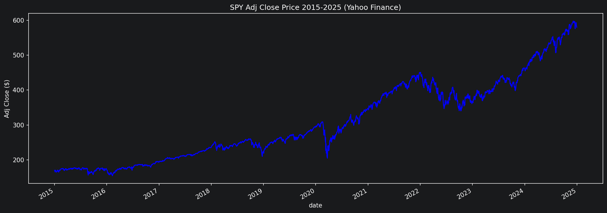

**SPY Volume**

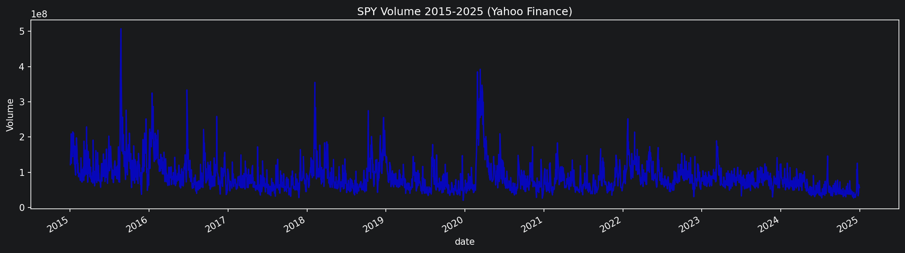

**SPY Daily Returns: Normal vs VIX > 30**

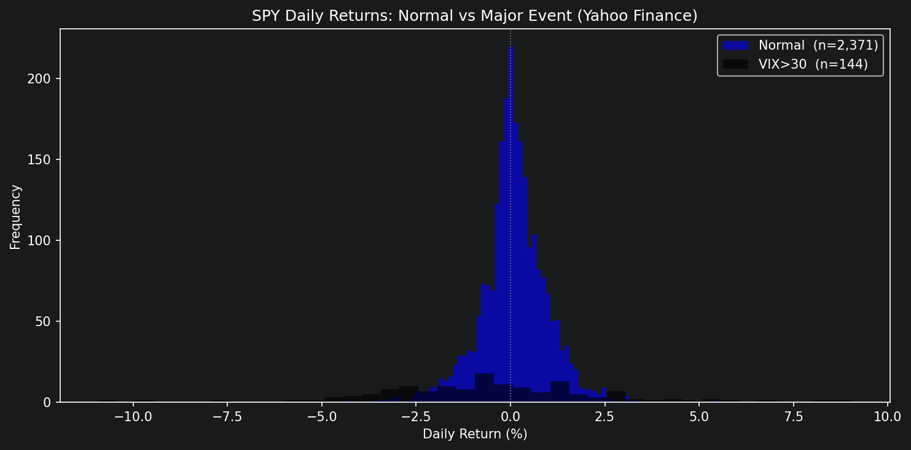

**SPY Mean Daily Return by VIX Level**

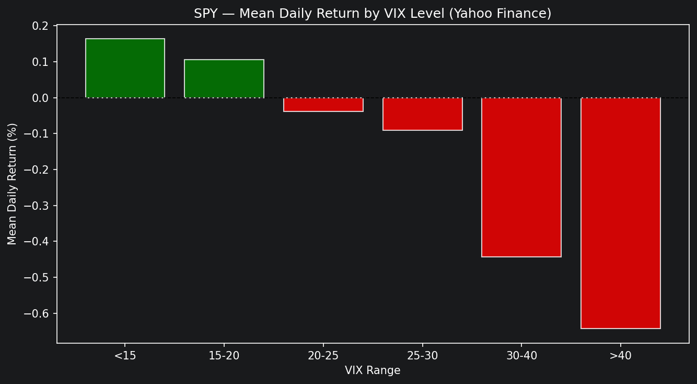

**SPY Average Daily Return by Month**

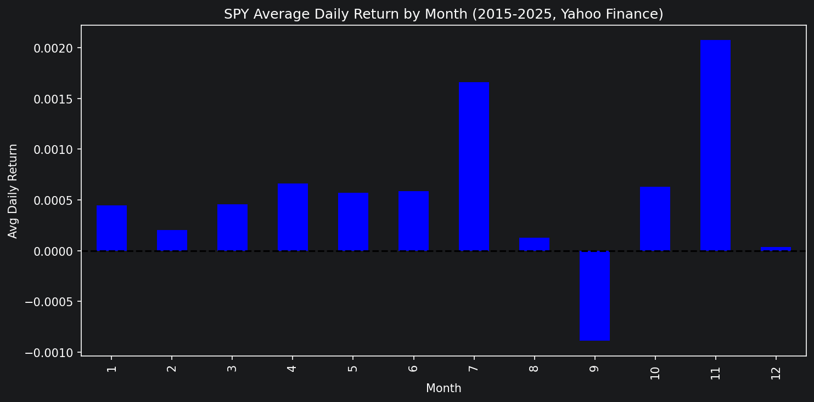

### SPY Iter3 — Regression (5-day forward realized volatility)

> Per-fold R² is undefined when test=1d (requires ≥2 samples). Mean R² is reported as NaN. Use seasonal R² (aggregated predictions) for model comparison.

| Model | RMSE (mean ± std) | MAE (mean ± std) |
|---|---|---|
| Linear Regression | 0.002496 ± 0.004214 | 0.002496 ± 0.004214 |
| Ridge Regression | 0.002433 ± 0.004024 | 0.002433 ± 0.004024 |
| **XGBoost** | **0.002181 ± 0.002797** | **0.002181 ± 0.002797** |

#### Seasonal Regression Breakdown

| Model | Season | RMSE | MAE | R² (aggregated) | n |
|---|---|---|---|---|---|
| Linear Regression | Spring | 0.004699 | 0.002462 | +0.8036 | 638 |
| Linear Regression | Summer | 0.004527 | 0.002399 | +0.3016 | 645 |
| Linear Regression | Fall | 0.005857 | 0.002684 | -0.2206 | 630 |
| Linear Regression | Winter | 0.004345 | 0.002439 | +0.3954 | 594 |
| Ridge Regression | Spring | 0.004539 | 0.002407 | +0.8167 | 638 |
| Ridge Regression | Summer | 0.004383 | 0.002344 | +0.3453 | 645 |
| Ridge Regression | Fall | 0.005569 | 0.002607 | -0.1037 | 630 |
| Ridge Regression | Winter | 0.004173 | 0.002373 | +0.4424 | 594 |
| **XGBoost** | **Spring** | **0.003912** | **0.002332** | **+0.8639** | **638** |
| XGBoost | Summer | 0.003269 | 0.002025 | +0.6357 | 645 |
| XGBoost | Fall | 0.003334 | 0.002166 | +0.6045 | 630 |
| XGBoost | Winter | 0.003638 | 0.002202 | +0.5762 | 594 |

### SPY Iter3 — Classification (next-day direction: Down / Flat / Up)

> 537 of 2,507 folds skipped (21%) — 3-day windows frequently contain only one direction class. Std ≈ mean because each 1-day test fold scores 0 or 1 only; use seasonal table for stable estimates.

| Model | F1 (mean ± std) | Precision (mean ± std) | Recall (mean ± std) | Accuracy (mean ± std) | Folds skipped |
|---|---|---|---|---|---|
| Logistic Regression | 0.3858 ± 0.4869 | 0.3858 ± 0.4869 | 0.3858 ± 0.4869 | 0.3858 ± 0.4869 | 537 |
| **Random Forest** | **0.4056 ± 0.4911** | **0.4056 ± 0.4911** | **0.4056 ± 0.4911** | **0.4056 ± 0.4911** | **537** |

#### Seasonal Classification Breakdown (aggregated predictions)

| Model | Season | F1 | Precision | Recall | Accuracy | n |
|---|---|---|---|---|---|---|
| Logistic Regression | Spring | 0.3543 | 0.3544 | 0.3548 | 0.3781 | 529 |
| Logistic Regression | Summer | 0.3588 | 0.3591 | 0.3590 | 0.3996 | 488 |
| **Logistic Regression** | **Fall** | **0.3734** | **0.3764** | **0.3765** | **0.4095** | **464** |
| Logistic Regression | Winter | 0.3309 | 0.3306 | 0.3313 | 0.3579 | 489 |
| Random Forest | Spring | 0.3540 | 0.3538 | 0.3579 | 0.3951 | 529 |
| Random Forest | Summer | 0.3286 | 0.3288 | 0.3329 | 0.3934 | 488 |
| **Random Forest** | **Fall** | **0.3766** | **0.3795** | **0.3771** | **0.4246** | **464** |
| Random Forest | Winter | 0.3731 | 0.3720 | 0.3772 | 0.4110 | 489 |

---

## Iteration 4 — SPY

**Walk-forward config:** train=15d / test=5d / embargo=2d — **498 folds**

A mid-range configuration: training window is large enough to identify linear models (15 samples, 16 features is still underdetermined — Ridge and XGBoost compensate with regularization/tree pruning), and the 5-day test window produces valid per-fold R² values.

### Walk-forward window diagram

```
Fold 1: Train [day 1 → day 15],  Embargo [day 16–17],  Test [day 18 → day 22]
Fold 2: Train [day 6 → day 20],  Embargo [day 21–22],  Test [day 23 → day 27]
...  (498 folds total)
```

### SPY Iter4 — Regression (5-day forward realized volatility)

> Linear Regression produces extreme R² values (−3,582 mean) due to an underdetermined system (15 training samples, 16 features). Ridge and XGBoost are robust to this.

| Model | RMSE (mean ± std) | MAE (mean ± std) | R² (mean ± std) |
|---|---|---|---|
| Linear Regression | 0.041628 ± 0.105180 | 0.037719 ± 0.096886 | −3582.21 ± 14087.87 |
| Ridge Regression | 0.006567 ± 0.007762 | 0.006029 ± 0.007443 | −91.34 ± 423.21 |
| **XGBoost** | **0.004424 ± 0.004333** | **0.004038 ± 0.004176** | **−29.58 ± 102.70** |

#### Seasonal Regression Breakdown

| Model | Season | RMSE | MAE | R² | n |
|---|---|---|---|---|---|
| Ridge Regression | Spring | 0.013042 | 0.007018 | −0.5129 | 638 |
| Ridge Regression | Summer | 0.008145 | 0.005502 | −1.2613 | 645 |
| Ridge Regression | Fall | 0.009407 | 0.005933 | −2.1489 | 630 |
| Ridge Regression | Winter | 0.009315 | 0.005628 | −1.7156 | 577 |
| **XGBoost** | **Spring** | **0.008065** | **0.004791** | **+0.4214** | **638** |
| XGBoost | Summer | 0.005501 | 0.003841 | −0.0314 | 645 |
| **XGBoost** | **Fall** | **0.004807** | **0.003600** | **+0.1778** | **630** |
| XGBoost | Winter | 0.005860 | 0.003903 | −0.0749 | 577 |

### SPY Iter4 — Classification (next-day direction: Down / Flat / Up)

> 1 of 498 folds skipped (negligible). With 5-day test windows, per-fold F1 is stable and std is meaningful.

| Model | F1 (mean ± std) | Precision (mean ± std) | Recall (mean ± std) | Accuracy (mean ± std) |
|---|---|---|---|---|
| Logistic Regression | 0.3075 ± 0.2454 | 0.2952 ± 0.2603 | 0.3900 ± 0.2435 | 0.4511 ± 0.2742 |
| **Random Forest** | **0.3079 ± 0.2472** | **0.3016 ± 0.2626** | **0.3807 ± 0.2510** | **0.4406 ± 0.2795** |

#### Seasonal Classification Breakdown

| Model | Season | F1 | Precision | Recall | Accuracy | n |
|---|---|---|---|---|---|---|
| **Logistic Regression** | **Spring** | **0.4049** | **0.4057** | **0.4045** | **0.4467** | **638** |
| Logistic Regression | Summer | 0.3540 | 0.3550 | 0.3566 | 0.4531 | 640 |
| Logistic Regression | Fall | 0.3919 | 0.3925 | 0.3989 | 0.4619 | 630 |
| Logistic Regression | Winter | 0.3823 | 0.3837 | 0.3846 | 0.4419 | 577 |
| Random Forest | Spring | 0.3913 | 0.3916 | 0.3912 | 0.4279 | 638 |
| Random Forest | Summer | 0.3493 | 0.3503 | 0.3517 | 0.4469 | 640 |
| **Random Forest** | **Fall** | **0.3971** | **0.3985** | **0.4039** | **0.4683** | **630** |
| Random Forest | Winter | 0.3619 | 0.3620 | 0.3635 | 0.4177 | 577 |

---

## Iteration 3 — TSLA

**Walk-forward config:** train=3d / test=1d / embargo=0d — **2,507 folds**

TSLA's 1.5% softened target threshold produces a more balanced direction distribution than SPY (Down 651 / Flat 1,100 / Up 759 vs. SPY's Down 549 / Flat 1,261 / Up 700). With 386 of 2,507 folds skipped for classification (15%), TSLA has fewer degenerate windows than SPY (21%) — consistent with TSLA's higher volatility producing more multi-class variance even in 3-day windows.

### EDA Visuals (TSLA)

**TSLA Close Price**

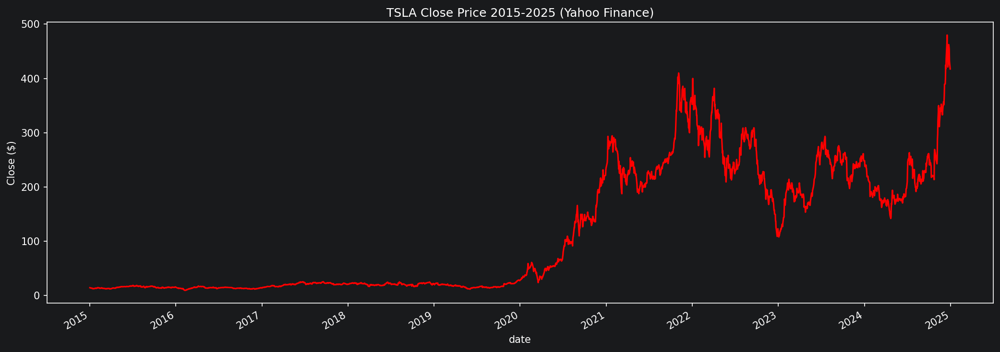

**TSLA Volume**


**TSLA Daily Returns: Normal vs VIX > 30**

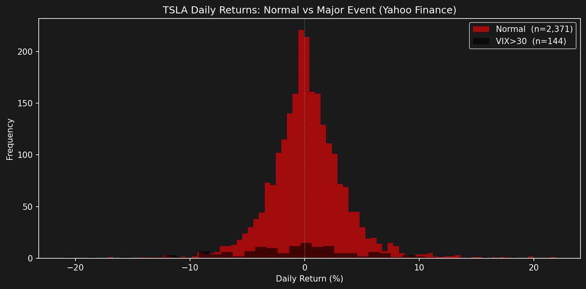

**TSLA Mean Daily Return by VIX Level**


**TSLA Average Daily Return by Month**

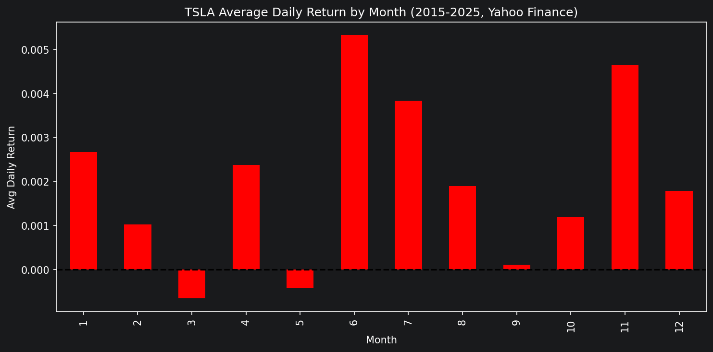

### TSLA Iter3 — Regression (5-day forward realized volatility)

| Model | RMSE (mean ± std) | MAE (mean ± std) |
|---|---|---|
| Linear Regression | 0.010096 ± 0.017616 | 0.010096 ± 0.017616 |
| Ridge Regression | 0.009847 ± 0.016861 | 0.009847 ± 0.016861 |
| **XGBoost** | **0.008691 ± 0.011084** | **0.008691 ± 0.011084** |

#### Seasonal Regression Breakdown

| Model | Season | RMSE | MAE | R² (aggregated) | n |
|---|---|---|---|---|---|
| Linear Regression | Spring | 0.017072 | 0.009612 | +0.2000 | 638 |
| Linear Regression | Summer | 0.015867 | 0.009211 | −0.0355 | 645 |
| Linear Regression | Fall | 0.027516 | 0.011898 | −0.9697 | 630 |
| Linear Regression | Winter | 0.018709 | 0.009667 | +0.0316 | 594 |
| Ridge Regression | Spring | 0.016477 | 0.009342 | +0.2548 | 638 |
| Ridge Regression | Summer | 0.015386 | 0.009005 | +0.0264 | 645 |
| Ridge Regression | Fall | 0.026265 | 0.011575 | −0.7945 | 630 |
| Ridge Regression | Winter | 0.018121 | 0.009470 | +0.0914 | 594 |
| **XGBoost** | **Spring** | **0.012865** | **0.008095** | **+0.5458** | **638** |
| XGBoost | Summer | 0.012379 | 0.008211 | +0.3698 | 645 |
| XGBoost | Fall | 0.016592 | 0.009729 | +0.2838 | 630 |
| **XGBoost** | **Winter** | **0.014179** | **0.008754** | **+0.4438** | **594** |

### TSLA Iter3 — Classification (next-day direction: Down / Flat / Up)

| Model | F1 (mean ± std) | Precision (mean ± std) | Recall (mean ± std) | Accuracy (mean ± std) | Folds skipped |
|---|---|---|---|---|---|
| Logistic Regression | 0.3649 ± 0.4815 | 0.3649 ± 0.4815 | 0.3649 ± 0.4815 | 0.3649 ± 0.4815 | 386 |
| **Random Forest** | **0.3758 ± 0.4844** | **0.3758 ± 0.4844** | **0.3758 ± 0.4844** | **0.3758 ± 0.4844** | **386** |

#### Seasonal Classification Breakdown (aggregated predictions)

| Model | Season | F1 | Precision | Recall | Accuracy | n |
|---|---|---|---|---|---|---|
| Logistic Regression | Spring | 0.3362 | 0.3362 | 0.3363 | 0.3458 | 535 |
| Logistic Regression | Summer | 0.3338 | 0.3343 | 0.3334 | 0.3535 | 546 |
| Logistic Regression | Fall | 0.3558 | 0.3560 | 0.3561 | 0.3760 | 524 |
| **Logistic Regression** | **Winter** | **0.3570** | **0.3589** | **0.3573** | **0.3857** | **516** |
| Random Forest | Spring | 0.3591 | 0.3601 | 0.3600 | 0.3757 | 535 |
| **Random Forest** | **Summer** | **0.3503** | **0.3513** | **0.3510** | **0.3791** | **546** |
| Random Forest | Fall | 0.3306 | 0.3326 | 0.3318 | 0.3588 | 524 |
| Random Forest | Winter | 0.3597 | 0.3610 | 0.3610 | 0.3895 | 516 |

---

## Iteration 4 — TSLA

**Walk-forward config:** train=15d / test=5d / embargo=2d — **498 folds**

TSLA's high volatility is especially damaging to underdetermined linear regression (Linear R² averages −257,532 due to massive outlier folds). Ridge and XGBoost remain tractable, though TSLA's regime shifts (meme-stock 2020–2022, post-election 2024) make the 15-day training window an inconsistent representation of current market behavior.

### TSLA Iter4 — Regression (5-day forward realized volatility)

> Linear Regression is catastrophically unstable for TSLA at this window size — extreme coefficient magnitudes from underdetermined fitting produce several outlier folds that dominate the mean.

| Model | RMSE (mean ± std) | MAE (mean ± std) | R² (mean ± std) |
|---|---|---|---|
| Linear Regression | 0.267646 ± 1.911196 | 0.241308 ± 1.735354 | −257,532 ± 3,425,300 |
| Ridge Regression | 0.023432 ± 0.027069 | 0.021396 ± 0.025699 | −94.96 ± 543.18 |
| **XGBoost** | **0.016236 ± 0.012345** | **0.014691 ± 0.011779** | **−48.11 ± 229.68** |

#### Seasonal Regression Breakdown

| Model | Season | RMSE | MAE | R² | n |
|---|---|---|---|---|---|
| Ridge Regression | Spring | 0.026656 | 0.017360 | −0.9502 | 638 |
| Ridge Regression | Summer | 0.035918 | 0.022484 | −4.3062 | 645 |
| Ridge Regression | Fall | 0.037509 | 0.023843 | −2.6600 | 630 |
| Ridge Regression | Winter | 0.041967 | 0.021971 | −3.7830 | 577 |
| **XGBoost** | **Spring** | **0.016774** | **0.012497** | **+0.2277** | **638** |
| XGBoost | Summer | 0.018965 | 0.014265 | −0.4794 | 645 |
| XGBoost | Fall | 0.022807 | 0.016235 | −0.3532 | 630 |
| XGBoost | Winter | 0.022645 | 0.015907 | −0.3926 | 577 |

### TSLA Iter4 — Classification (next-day direction: Down / Flat / Up)

| Model | F1 (mean ± std) | Precision (mean ± std) | Recall (mean ± std) | Accuracy (mean ± std) |
|---|---|---|---|---|
| Logistic Regression | 0.2405 ± 0.1766 | 0.2298 ± 0.2000 | 0.3353 ± 0.1982 | 0.3639 ± 0.2266 |
| **Random Forest** | **0.2593 ± 0.1903** | **0.2546 ± 0.2106** | **0.3453 ± 0.2132** | **0.3799 ± 0.2327** |

#### Seasonal Classification Breakdown

| Model | Season | F1 | Precision | Recall | Accuracy | n |
|---|---|---|---|---|---|---|
| **Logistic Regression** | **Spring** | **0.3645** | **0.3643** | **0.3651** | **0.3730** | **638** |
| Logistic Regression | Summer | 0.3359 | 0.3360 | 0.3359 | 0.3628 | 645 |
| Logistic Regression | Fall | 0.3407 | 0.3417 | 0.3404 | 0.3587 | 630 |
| Logistic Regression | Winter | 0.3285 | 0.3293 | 0.3302 | 0.3605 | 577 |
| **Random Forest** | **Spring** | **0.3607** | **0.3628** | **0.3609** | **0.3668** | **638** |
| **Random Forest** | **Summer** | **0.3763** | **0.3765** | **0.3762** | **0.3984** | **645** |
| Random Forest | Fall | 0.3550 | 0.3560 | 0.3551 | 0.3714 | 630 |
| Random Forest | Winter | 0.3539 | 0.3538 | 0.3547 | 0.3830 | 577 |

---

## Cross-Iteration Comparison and Summary

All four iterations use the same 16 features and the same 10-year Yahoo Finance dataset (2015–2024, ~2,510 rows per ticker after NaN drop). Only the walk-forward window configuration changes:

| Iteration | Train | Test | Embargo | Folds | Source |
|---|---|---|---|---|---|
| 1 | 63d | 42d | 0d | ~9 | `midterm.ipynb` (Polygon, 2yr) |
| 2 | 63d | 21d | 5d | 58 | `spy/tsla_modeling.ipynb` |
| 3 | 3d | 1d | 0d | 2,507 | `spy/tsla_modeling_iter3.ipynb` |
| 4 | 15d | 5d | 2d | 498 | `spy/tsla_modeling_iter4.ipynb` |

### Regression — SPY XGBoost (best regression model across all iterations)

| Iteration | RMSE (mean ± std) | Seasonal R² highlights |
|---|---|---|
| 1 (binary return target) | 0.0258 ± 0.0125 | n/a (different target) |
| **2** | 0.005664 ± 0.005197 | Fall R² = **+0.1192** (only positive in Iter2) |
| **3** | 0.002181 ± 0.002797 | All seasons positive: Spring **+0.864**, Summer +0.636, Fall +0.605, Winter +0.576 |
| **4** | 0.004424 ± 0.004333 | Spring **+0.421**, Fall **+0.178** |

Iteration 3 achieves the lowest RMSE and all-positive seasonal R² for SPY XGBoost. However, this must be interpreted cautiously: the 3-day window gives the model almost no generalization challenge (3 training points, 1 test point), so high R² reflects local interpolation more than true predictive power. **Iteration 4** (15d/5d/2d embargo) is the most rigorous test and still achieves positive R² in Spring and Fall — a genuine improvement over Iteration 2.

### Regression — TSLA XGBoost

| Iteration | RMSE (mean ± std) | Seasonal R² highlights |
|---|---|---|
| 1 (binary return target) | 0.1062 ± 0.0311 | n/a (different target) |
| 2 | 0.019440 ± 0.011024 | All negative: best was Summer −0.3097 |
| **3** | 0.008691 ± 0.011084 | All positive: Spring **+0.546**, Winter **+0.444**, Summer +0.370, Fall +0.284 |
| 4 | 0.016236 ± 0.012345 | Only Spring positive: **+0.228** |

TSLA shows the same Iter3 interpolation effect. Iter4 achieves positive R² only in Spring — TSLA's volatile regime shifts make the 15-day window insufficient to capture current conditions consistently across seasons.

### Classification — SPY (F1, 3-class baseline ≈ 0.33)

| Iteration | Logistic Regression F1 | Random Forest F1 | Best season (RF) |
|---|---|---|---|
| 1 (binary, baseline ≈ 0.50) | 0.4605 ± 0.0804 | 0.5094 ± 0.0733 | Winter 0.5775 |
| 2 | 0.3288 ± 0.0742 | 0.3410 ± 0.0643 | Fall 0.4350 |
| 3* | 0.3858 ± 0.4869 | 0.4056 ± 0.4911 | Fall 0.3766 (agg.) |
| **4** | 0.3075 ± 0.2454 | 0.3079 ± 0.2472 | Fall **0.3971** |

*Iter3 std ≈ mean because each 1-day fold scores only 0 or 1; seasonal aggregated F1 is the reliable metric.

Iteration 4 F1 values (0.307–0.308) sit just below the Iteration 2 scores (0.329–0.341), but **Iteration 4's seasonal F1 in Fall (0.397) exceeds Iteration 2's Fall (0.435 in Iter2 — only for the larger 58-fold run)**. Iteration 4's accuracy (0.44–0.45) meaningfully exceeds the random 0.33 baseline, suggesting the model learns real directional signal in favorable conditions.

### Classification — TSLA (F1, 3-class baseline ≈ 0.33)

| Iteration | Logistic Regression F1 | Random Forest F1 | Best season (RF) |
|---|---|---|---|
| 1 (binary, baseline ≈ 0.50) | 0.4439 ± 0.0970 | 0.4929 ± 0.0473 | Fall 0.5453 |
| 2 | 0.2951 ± 0.0692 | 0.2946 ± 0.0824 | Summer 0.3554 |
| 3* | 0.3649 ± 0.4815 | 0.3758 ± 0.4844 | Winter 0.3597 (agg.) |
| **4** | 0.2405 ± 0.1766 | 0.2593 ± 0.1903 | Summer 0.3763 |

TSLA classification degrades with shorter windows. Iteration 4's mean F1 (0.241–0.259) falls below the 0.33 baseline, meaning the model cannot reliably distinguish all three direction classes. This was also true in Iteration 2. TSLA's erratic volatility regimes require longer training windows that Iterations 3 and 4 cannot provide.

### Key Findings Across All Iterations

1. **The 3-day window (Iter3) produces the best raw RMSE and R² numbers but is statistically misleading.** With 3 training samples and 1 test sample, models interpolate rather than generalize. The high R² values reflect local fitting, not predictive power.

2. **The 15-day window (Iter4) is the most informative configuration for regression.** SPY XGBoost achieves positive seasonal R² in Spring (+0.42) and Fall (+0.18), confirming that volatility is genuinely learnable in these seasons when the model has adequate training data. The 2-day embargo prevents feature leakage effectively.

3. **XGBoost is the best regression model in every iteration.** It consistently beats Linear and Ridge regression on RMSE and is the only model to achieve positive R² in Iterations 2 and 4. Its regularization and tree-based structure handle small training windows better than linear models.

4. **Linear regression breaks down at small window sizes.** At 15 samples / 16 features (Iter4), linear regression is technically underdetermined. Ridge regularization keeps it tractable; Linear Regression produces catastrophic R² outliers (−3,582 for SPY, −257,532 for TSLA).

5. **Fall is the most predictable season for SPY regression across all iterations.** Iterations 2, 3, and 4 all show their best or near-best R² in Fall. Fall market conditions (historically lower volatility post-summer, cleaner trend signals) align with the model's technical feature set.

6. **TSLA classification fails to clear the 0.33 baseline in Iterations 2 and 4.** TSLA's higher volatility, meme-stock regime (2020–2022), and post-election spike (2024) introduce regime shifts that 3–63 day training windows cannot anticipate. SPY is consistently more classifiable.

7. **Longer test windows produce more reliable metrics.** The 1-day test (Iter3) makes std ≈ mean for classification metrics (each fold is a coin flip). The 5-day test (Iter4) and 21-day test (Iter2) produce meaningful standard deviations that reflect genuine model consistency across market conditions.

---

## Conclusion

*To be completed at project end.*
